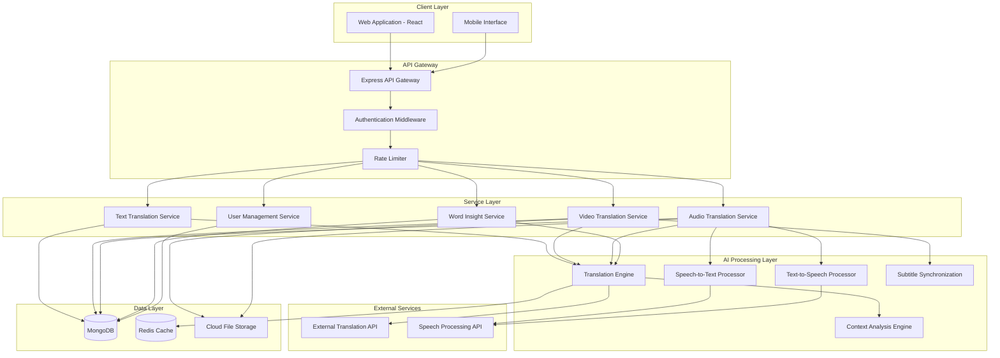

# Design Document: Multilingual Communication Platform

## Overview

The multilingual communication platform is a cloud-based system that provides real-time translation services for text, video, and audio content. The platform is designed with a focus on accessibility for rural and non-tech users in underserved communities, offering a simple interface while maintaining powerful AI-driven translation capabilities.

The system follows a three-layer AI architecture:
1. **Content Translation Layer**: Handles text, video subtitle, and document translation
2. **Real-Time Communication Layer**: Manages speech-to-speech translation for live conversations
3. **Smart Word Insight Layer**: Provides vocabulary learning and word-level insights

The platform is built using a modern web stack (React frontend, Node.js backend, MongoDB database) and integrates with external translation APIs for high-quality language processing.

## Architecture

### High-Level Architecture



### Component Interaction Flow

**Text Translation Flow:**
1. User submits text through Web/Mobile interface
2. API Gateway authenticates and rate-limits the request
3. Text Translation Service receives the request
4. Context Analyzer examines the text structure
5. Translation Engine calls external API with context
6. Result is cached and returned to user
7. Translation is stored in MongoDB for history

**Video Translation Flow:**
1. User uploads video or provides video URL
2. Video Service stores file in Cloud Storage
3. Subtitle extraction/generation occurs
4. Subtitles are translated via Translation Engine
5. Subtitle Sync component aligns timing
6. Translated subtitles are returned and cached

**Audio Translation Flow (Real-Time):**
1. User speaks into microphone
2. Audio chunks stream to Audio Service
3. Speech-to-Text converts audio to text
4. Translation Engine translates text
5. Text-to-Speech converts to target language audio
6. Audio streams back to user
7. Bidirectional flow maintained for conversations

## Components and Interfaces

### 1. API Gateway

**Responsibilities:**
- Route requests to appropriate services
- Handle authentication and authorization
- Apply rate limiting
- Log requests and responses
- Handle CORS and security headers

**Interface:**
```typescript
interface APIGateway {
  // Authentication
  authenticate(token: string): Promise<User>;
  
  // Rate limiting
  checkRateLimit(userId: string, endpoint: string): Promise<boolean>;
  
  // Request routing
  routeRequest(request: Request): Promise<Response>;
}
```

### 2. Text Translation Service

**Responsibilities:**
- Process text translation requests
- Handle multiple input formats (plain text, HTML, Markdown)
- Preserve formatting during translation
- Cache frequently translated content

**Interface:**
```typescript
interface TextTranslationService {
  translateText(params: {
    text: string;
    sourceLanguage: string;
    targetLanguage: string;
    format?: 'plain' | 'html' | 'markdown';
    userId: string;
  }): Promise<TranslationResult>;
  
  translateDocument(params: {
    fileBuffer: Buffer;
    fileType: 'pdf' | 'docx' | 'txt';
    sourceLanguage: string;
    targetLanguage: string;
    userId: string;
  }): Promise<DocumentTranslationResult>;
}

interface TranslationResult {
  translatedText: string;
  sourceLanguage: string;
  targetLanguage: string;
  confidenceScore: number;
  timestamp: Date;
}

interface DocumentTranslationResult extends TranslationResult {
  originalFileName: string;
  translatedFileUrl: string;
}
```

### 3. Video Translation Service

**Responsibilities:**
- Extract or generate video subtitles
- Translate subtitles to target language
- Synchronize subtitle timing with video
- Handle multiple video formats

**Interface:**
```typescript
interface VideoTranslationService {
  processVideo(params: {
    videoUrl: string;
    sourceLanguage: string;
    targetLanguage: string;
    userId: string;
  }): Promise<VideoTranslationResult>;
  
  extractSubtitles(videoUrl: string): Promise<Subtitle[]>;
  
  generateSubtitles(videoUrl: string, language: string): Promise<Subtitle[]>;
  
  synchronizeSubtitles(
    subtitles: Subtitle[],
    videoMetadata: VideoMetadata
  ): Promise<Subtitle[]>;
}

interface Subtitle {
  id: string;
  startTime: number; // milliseconds
  endTime: number;
  text: string;
  translatedText?: string;
}

interface VideoTranslationResult {
  videoUrl: string;
  subtitles: Subtitle[];
  targetLanguage: string;
  processingTime: number;
}

interface VideoMetadata {
  duration: number;
  fps: number;
  format: string;
}
```

### 4. Audio Translation Service

**Responsibilities:**
- Handle real-time audio streaming
- Convert speech to text
- Translate text content
- Convert translated text back to speech
- Manage bidirectional communication

**Interface:**
```typescript
interface AudioTranslationService {
  startSession(params: {
    userId: string;
    sourceLanguage: string;
    targetLanguage: string;
  }): Promise<SessionId>;
  
  processAudioChunk(params: {
    sessionId: SessionId;
    audioChunk: Buffer;
    timestamp: number;
  }): Promise<AudioProcessingResult>;
  
  endSession(sessionId: SessionId): Promise<SessionSummary>;
}

interface AudioProcessingResult {
  transcribedText: string;
  translatedText: string;
  audioResponse: Buffer;
  latency: number;
}

interface SessionSummary {
  sessionId: SessionId;
  duration: number;
  totalUtterances: number;
  averageLatency: number;
}

type SessionId = string;
```

### 5. Word Insight Service

**Responsibilities:**
- Provide word definitions and meanings
- Generate pronunciation guides
- Fetch usage examples
- Manage user's saved words collection
- Create revision quizzes

**Interface:**
```typescript
interface WordInsightService {
  getWordInsight(params: {
    word: string;
    sourceLanguage: string;
    targetLanguage: string;
    context?: string;
  }): Promise<WordInsight>;
  
  saveWord(params: {
    userId: string;
    word: string;
    wordInsight: WordInsight;
  }): Promise<void>;
  
  getSavedWords(userId: string): Promise<SavedWord[]>;
  
  removeWord(userId: string, wordId: string): Promise<void>;
  
  generateRevisionQuiz(userId: string, count: number): Promise<Quiz>;
}

interface WordInsight {
  word: string;
  meaningInSource: string;
  meaningInTarget: string;
  pronunciation: string; // IPA notation
  usageExamples: UsageExample[];
  partOfSpeech: string;
}

interface UsageExample {
  sentence: string;
  translation: string;
}

interface SavedWord {
  id: string;
  word: string;
  insight: WordInsight;
  savedAt: Date;
}

interface Quiz {
  questions: QuizQuestion[];
}

interface QuizQuestion {
  word: string;
  type: 'meaning' | 'usage' | 'pronunciation';
  question: string;
  options: string[];
  correctAnswer: string;
}
```

### 6. User Management Service

**Responsibilities:**
- Handle user registration and authentication
- Manage user preferences and settings
- Store language preferences
- Synchronize data across devices

**Interface:**
```typescript
interface UserManagementService {
  registerUser(params: {
    email: string;
    password: string;
    preferredLanguage: string;
  }): Promise<User>;
  
  authenticateUser(email: string, password: string): Promise<AuthToken>;
  
  updatePreferences(userId: string, preferences: UserPreferences): Promise<void>;
  
  getPreferences(userId: string): Promise<UserPreferences>;
  
  syncUserData(userId: string, deviceId: string): Promise<UserData>;
}

interface User {
  id: string;
  email: string;
  createdAt: Date;
  lastLoginAt: Date;
}

interface UserPreferences {
  preferredLanguage: string;
  secondaryLanguages: string[];
  interfaceLanguage: string;
  autoTranslate: boolean;
  showConfidenceScores: boolean;
}

interface AuthToken {
  token: string;
  expiresAt: Date;
  refreshToken: string;
}

interface UserData {
  preferences: UserPreferences;
  savedWords: SavedWord[];
  translationHistory: TranslationHistoryItem[];
}

interface TranslationHistoryItem {
  id: string;
  type: 'text' | 'video' | 'audio';
  sourceLanguage: string;
  targetLanguage: string;
  timestamp: Date;
  preview: string;
}
```

### 7. Translation Engine

**Responsibilities:**
- Interface with external translation APIs
- Apply context-aware translation logic
- Handle idiomatic expressions
- Maintain translation quality
- Implement fallback mechanisms

**Interface:**
```typescript
interface TranslationEngine {
  translate(params: {
    text: string;
    sourceLanguage: string;
    targetLanguage: string;
    context?: ContextInfo;
  }): Promise<Translation>;
  
  batchTranslate(params: {
    texts: string[];
    sourceLanguage: string;
    targetLanguage: string;
  }): Promise<Translation[]>;
  
  detectLanguage(text: string): Promise<LanguageDetectionResult>;
}

interface Translation {
  originalText: string;
  translatedText: string;
  sourceLanguage: string;
  targetLanguage: string;
  confidenceScore: number;
  alternatives?: string[];
}

interface ContextInfo {
  domain?: string; // e.g., 'medical', 'legal', 'education'
  formality?: 'formal' | 'informal';
  surroundingText?: string;
}

interface LanguageDetectionResult {
  language: string;
  confidence: number;
  alternatives: Array<{ language: string; confidence: number }>;
}
```

### 8. Context Analyzer

**Responsibilities:**
- Analyze sentence structure and semantics
- Identify idiomatic expressions
- Determine appropriate formality level
- Resolve ambiguous terms using context

**Interface:**
```typescript
interface ContextAnalyzer {
  analyzeContext(params: {
    text: string;
    language: string;
  }): Promise<ContextAnalysis>;
  
  identifyIdioms(text: string, language: string): Promise<Idiom[]>;
  
  determineFormalityLevel(text: string, language: string): Promise<FormalityLevel>;
}

interface ContextAnalysis {
  domain: string;
  formality: FormalityLevel;
  idioms: Idiom[];
  ambiguousTerms: AmbiguousTerm[];
  sentiment: 'positive' | 'neutral' | 'negative';
}

interface Idiom {
  phrase: string;
  meaning: string;
  startIndex: number;
  endIndex: number;
}

interface AmbiguousTerm {
  term: string;
  possibleMeanings: string[];
  recommendedMeaning: string;
  confidence: number;
}

type FormalityLevel = 'very_formal' | 'formal' | 'neutral' | 'informal' | 'very_informal';
```

## Data Models

### User Model

```typescript
interface UserDocument {
  _id: ObjectId;
  email: string;
  passwordHash: string;
  createdAt: Date;
  lastLoginAt: Date;
  preferences: {
    preferredLanguage: string;
    secondaryLanguages: string[];
    interfaceLanguage: string;
    autoTranslate: boolean;
    showConfidenceScores: boolean;
  };
  profile: {
    name?: string;
    region?: string;
    educationLevel?: string;
  };
  subscription: {
    tier: 'free' | 'basic' | 'premium';
    expiresAt?: Date;
  };
}
```

### Saved Word Model

```typescript
interface SavedWordDocument {
  _id: ObjectId;
  userId: ObjectId;
  word: string;
  sourceLanguage: string;
  targetLanguage: string;
  meaningInSource: string;
  meaningInTarget: string;
  pronunciation: string;
  usageExamples: Array<{
    sentence: string;
    translation: string;
  }>;
  partOfSpeech: string;
  savedAt: Date;
  reviewCount: number;
  lastReviewedAt?: Date;
}
```

### Translation History Model

```typescript
interface TranslationHistoryDocument {
  _id: ObjectId;
  userId: ObjectId;
  type: 'text' | 'video' | 'audio' | 'document';
  sourceLanguage: string;
  targetLanguage: string;
  originalContent: string;
  translatedContent: string;
  confidenceScore: number;
  timestamp: Date;
  metadata: {
    fileUrl?: string;
    fileName?: string;
    duration?: number;
    format?: string;
  };
}
```

### Audio Session Model

```typescript
interface AudioSessionDocument {
  _id: ObjectId;
  userId: ObjectId;
  sourceLanguage: string;
  targetLanguage: string;
  startTime: Date;
  endTime?: Date;
  utterances: Array<{
    timestamp: Date;
    transcribedText: string;
    translatedText: string;
    audioUrl: string;
    latency: number;
  }>;
  status: 'active' | 'completed' | 'error';
  averageLatency?: number;
}
```

### Video Translation Model

```typescript
interface VideoTranslationDocument {
  _id: ObjectId;
  userId: ObjectId;
  videoUrl: string;
  originalVideoUrl?: string;
  sourceLanguage: string;
  targetLanguage: string;
  subtitles: Array<{
    id: string;
    startTime: number;
    endTime: number;
    originalText: string;
    translatedText: string;
  }>;
  videoMetadata: {
    duration: number;
    format: string;
    size: number;
  };
  createdAt: Date;
  status: 'processing' | 'completed' | 'error';
}
```

### Language Support Model

```typescript
interface LanguageSupportDocument {
  _id: ObjectId;
  languageCode: string; // ISO 639-1 code
  languageName: string;
  nativeName: string;
  region: 'indian' | 'global';
  isActive: boolean;
  supportedFeatures: {
    textTranslation: boolean;
    speechToText: boolean;
    textToSpeech: boolean;
    videoSubtitles: boolean;
  };
  specializedDomains: string[]; // e.g., ['medical', 'legal', 'education']
}
```

## Correctness Properties

*A property is a characteristic or behavior that should hold true across all valid executions of a system—essentially, a formal statement about what the system should do. Properties serve as the bridge between human-readable specifications and machine-verifiable correctness guarantees.*


### Property Reflection

After analyzing all acceptance criteria, I've identified the following properties and eliminated redundancy:

**Consolidated Properties:**
- Properties 4.4, 4.5, and 4.6 (word saving, retrieval, and deletion) can be combined into comprehensive CRUD properties
- Properties 1.2 and 7.1 (language preference persistence) are redundant - combined into one property
- Properties 7.2 and 7.4 (preference loading and cross-device sync) test similar persistence behavior - kept separate as they test different scenarios
- Properties 9.2 and 9.3 (error reporting and logging) are redundant - combined into one property

**Properties Providing Unique Value:**
- Translation properties (1.1, 1.5, 2.2) each test different translation scenarios
- Subtitle properties (2.1, 2.3, 2.6) test distinct aspects of video processing
- Word insight properties (4.1, 4.2, 4.3) each validate different required fields
- Security properties (10.5, 10.6, 10.7) test independent security mechanisms

### Correctness Properties

**Property 1: Text translation produces target language output**
*For any* text content and any supported source-target language pair, translating the text should produce output in the target language.
**Validates: Requirements 1.1**

**Property 2: Language preference persistence**
*For any* user and any supported language, when the user selects that language as their preference, retrieving the user's preferences should return that same language.
**Validates: Requirements 1.2, 7.1**

**Property 3: Language switching triggers re-translation**
*For any* content and any two different target languages, translating to language A then switching to language B should produce a different translation than the original.
**Validates: Requirements 1.5**

**Property 4: Video subtitle generation**
*For any* valid video file, processing the video should produce a non-empty array of subtitles with valid timing information.
**Validates: Requirements 2.1**

**Property 5: Subtitle translation completeness**
*For any* array of subtitles and any target language, translating the subtitles should produce the same number of translated subtitles with all text fields populated.
**Validates: Requirements 2.2**

**Property 6: Subtitle timing preservation**
*For any* array of subtitles, translating them should preserve the original startTime and endTime values for each subtitle.
**Validates: Requirements 2.3**

**Property 7: Missing subtitle generation fallback**
*For any* video without embedded subtitles, processing the video should generate subtitles using speech recognition before translation.
**Validates: Requirements 2.6**

**Property 8: Audio noise reduction application**
*For any* audio input with noise level above threshold, the speech processor should apply noise reduction before transcription.
**Validates: Requirements 3.5**

**Property 9: Bidirectional communication support**
*For any* two users with different source languages, both users should be able to send messages and receive translations in their respective target languages.
**Validates: Requirements 3.6**

**Property 10: Word insight completeness**
*For any* word in translated content, requesting word insight should return meanings in both source and target languages.
**Validates: Requirements 4.1**

**Property 11: Word insight includes pronunciation**
*For any* word insight, it should contain a non-empty pronunciation field in phonetic notation.
**Validates: Requirements 4.2**

**Property 12: Word insight includes sufficient examples**
*For any* word insight, it should contain at least 2 usage examples with both original and translated sentences.
**Validates: Requirements 4.3**

**Property 13: Saved word persistence**
*For any* user and any word, when the user saves the word, it should appear in the user's saved words collection upon retrieval.
**Validates: Requirements 4.4**

**Property 14: Saved word retrieval completeness**
*For any* user with N saved words, retrieving the saved words collection should return all N words with complete insight data.
**Validates: Requirements 4.5**

**Property 15: Saved word deletion**
*For any* user and any saved word, when the user removes the word, it should no longer appear in the saved words collection.
**Validates: Requirements 4.6**

**Property 16: Quiz generation from saved words**
*For any* user with saved words, requesting a revision quiz should generate questions based on those saved words.
**Validates: Requirements 4.7**

**Property 17: Error message localization**
*For any* error condition and any user with a selected language, the error message should be displayed in that user's language.
**Validates: Requirements 6.5**

**Property 18: Request queueing during connectivity loss**
*For any* translation request made when connectivity is unavailable, the request should be queued and processed when connectivity is restored.
**Validates: Requirements 6.7**

**Property 19: Preference loading on return**
*For any* user with saved preferences, when the user returns to the platform (new session), their preferences should be automatically loaded.
**Validates: Requirements 7.2**

**Property 20: Cross-device data synchronization**
*For any* user with saved words and preferences on device A, accessing the platform from device B should show the same saved words and preferences.
**Validates: Requirements 7.4**

**Property 21: API authentication enforcement**
*For any* API request without valid authentication credentials, the platform should reject the request with an authentication error.
**Validates: Requirements 8.2**

**Property 22: Webhook notification on completion**
*For any* translation request with webhook configuration, when the translation completes, a webhook notification should be sent to the configured endpoint.
**Validates: Requirements 8.5**

**Property 23: Multi-tenant data isolation**
*For any* two different organizations, data created by organization A should not be accessible to organization B.
**Validates: Requirements 8.6**

**Property 24: Translation error reporting and logging**
*For any* user-reported translation error, the platform should create a log entry containing the error details, original text, translation, and user feedback.
**Validates: Requirements 9.2, 9.3**

**Property 25: Confidence score display for low-confidence translations**
*For any* translation with confidence score below 90%, the result should include the confidence score in the response.
**Validates: Requirements 9.4**

**Property 26: User data deletion**
*For any* user requesting data deletion, all personal data including translation history, saved words, and preferences should be removed from the system.
**Validates: Requirements 10.5**

**Property 27: Rate limiting enforcement**
*For any* user making more than 100 translation requests in a 60-second window, subsequent requests should be rejected with a rate limit error.
**Validates: Requirements 10.6**

**Property 28: Suspicious activity account suspension**
*For any* user account exhibiting suspicious activity patterns, the account should be temporarily suspended and a notification sent to the user.
**Validates: Requirements 10.7**

**Property 29: API failover to alternative providers**
*For any* translation request when the primary external API is unavailable, the platform should automatically use an alternative translation provider.
**Validates: Requirements 11.5**

**Property 30: Error logging with sufficient detail**
*For any* error occurring in the system, a log entry should be created containing timestamp, error type, error message, stack trace, and context information.
**Validates: Requirements 11.6**

**Property 31: Format preservation in structured content**
*For any* HTML or Markdown content, translating the content should preserve all structural elements (tags, links, formatting) while translating the text.
**Validates: Requirements 12.2**

**Property 32: Unsupported format error messaging**
*For any* file upload with an unsupported format, the platform should return an error message listing all supported formats for that content type.
**Validates: Requirements 12.7**

## Error Handling

### Error Categories

**1. Translation Errors**
- External API failures
- Unsupported language pairs
- Content too large for processing
- Invalid input format

**Error Handling Strategy:**
```typescript
class TranslationError extends Error {
  constructor(
    message: string,
    public code: string,
    public retryable: boolean,
    public details?: any
  ) {
    super(message);
  }
}

// Example error codes
const ERROR_CODES = {
  API_UNAVAILABLE: 'TRANS_001',
  UNSUPPORTED_LANGUAGE: 'TRANS_002',
  CONTENT_TOO_LARGE: 'TRANS_003',
  INVALID_FORMAT: 'TRANS_004',
  RATE_LIMIT_EXCEEDED: 'TRANS_005'
};
```

**2. Authentication Errors**
- Invalid credentials
- Expired tokens
- Insufficient permissions
- Rate limit exceeded

**Error Handling Strategy:**
- Return appropriate HTTP status codes (401, 403, 429)
- Include clear error messages in user's language
- Provide refresh token mechanism for expired tokens
- Log authentication failures for security monitoring

**3. Data Validation Errors**
- Missing required fields
- Invalid data types
- Constraint violations
- File size/format violations

**Error Handling Strategy:**
- Validate input at API boundary
- Return detailed validation errors with field-level information
- Use JSON Schema or similar for consistent validation
- Sanitize error messages to avoid exposing internal details

**4. System Errors**
- Database connection failures
- File storage errors
- Memory/resource exhaustion
- Network timeouts

**Error Handling Strategy:**
- Implement circuit breakers for external dependencies
- Use exponential backoff for retries
- Graceful degradation (e.g., disable non-critical features)
- Queue requests when possible during temporary outages

### Error Response Format

All API errors follow a consistent format:

```typescript
interface ErrorResponse {
  error: {
    code: string;
    message: string;
    details?: any;
    retryable: boolean;
    timestamp: string;
  };
}
```

### Retry Logic

```typescript
interface RetryConfig {
  maxAttempts: number;
  initialDelay: number; // milliseconds
  maxDelay: number;
  backoffMultiplier: number;
}

const DEFAULT_RETRY_CONFIG: RetryConfig = {
  maxAttempts: 3,
  initialDelay: 1000,
  maxDelay: 10000,
  backoffMultiplier: 2
};
```

### Fallback Mechanisms

**Translation API Fallback:**
1. Primary: External Translation API (e.g., Google Translate API)
2. Secondary: Alternative Translation API (e.g., Microsoft Translator)
3. Tertiary: Cached translations (if available)
4. Final: Error message with retry option

**Speech Processing Fallback:**
1. Primary: External Speech API
2. Secondary: Alternative Speech API
3. Final: Error message indicating service unavailable

### User-Facing Error Messages

All error messages must be:
- Displayed in the user's selected language
- Clear and actionable
- Free of technical jargon
- Include recovery steps when possible

Example error messages:
- "Translation service is temporarily unavailable. Please try again in a few moments."
- "The file you uploaded is too large. Please upload a file smaller than 50MB."
- "We couldn't detect the language of your text. Please select the source language manually."

## Testing Strategy

### Overview

The testing strategy employs a dual approach combining unit tests for specific examples and edge cases with property-based tests for universal correctness properties. This ensures both concrete bug detection and general correctness verification.

### Property-Based Testing

**Framework Selection:**
- **JavaScript/TypeScript**: fast-check library
- **Configuration**: Minimum 100 iterations per property test
- **Tagging**: Each test references its design document property

**Property Test Structure:**
```typescript
import fc from 'fast-check';

// Feature: multilingual-communication-platform, Property 1: Text translation produces target language output
describe('Translation Engine Properties', () => {
  it('should produce target language output for any text and language pair', () => {
    fc.assert(
      fc.property(
        fc.string({ minLength: 1, maxLength: 5000 }),
        fc.constantFrom(...SUPPORTED_LANGUAGES),
        fc.constantFrom(...SUPPORTED_LANGUAGES),
        async (text, sourceLang, targetLang) => {
          fc.pre(sourceLang !== targetLang); // Precondition
          
          const result = await translationEngine.translate({
            text,
            sourceLanguage: sourceLang,
            targetLanguage: targetLang
          });
          
          // Verify output is in target language
          const detectedLang = await translationEngine.detectLanguage(result.translatedText);
          expect(detectedLang.language).toBe(targetLang);
        }
      ),
      { numRuns: 100 }
    );
  });
});
```

**Property Test Coverage:**
- All 32 correctness properties must have corresponding property tests
- Each property test must run minimum 100 iterations
- Tests must use appropriate generators for domain-specific data
- Tests must include preconditions to filter invalid inputs

### Unit Testing

**Framework Selection:**
- **JavaScript/TypeScript**: Jest
- **Focus Areas**: Specific examples, edge cases, error conditions, integration points

**Unit Test Structure:**
```typescript
describe('Text Translation Service', () => {
  describe('translateText', () => {
    it('should translate simple English text to Hindi', async () => {
      const result = await textTranslationService.translateText({
        text: 'Hello, world!',
        sourceLanguage: 'en',
        targetLanguage: 'hi',
        userId: 'test-user-123'
      });
      
      expect(result.translatedText).toBeTruthy();
      expect(result.sourceLanguage).toBe('en');
      expect(result.targetLanguage).toBe('hi');
      expect(result.confidenceScore).toBeGreaterThan(0);
    });
    
    it('should handle empty text input', async () => {
      await expect(
        textTranslationService.translateText({
          text: '',
          sourceLanguage: 'en',
          targetLanguage: 'hi',
          userId: 'test-user-123'
        })
      ).rejects.toThrow('Text cannot be empty');
    });
    
    it('should preserve HTML formatting', async () => {
      const htmlText = '<p>Hello <strong>world</strong>!</p>';
      const result = await textTranslationService.translateText({
        text: htmlText,
        sourceLanguage: 'en',
        targetLanguage: 'hi',
        format: 'html',
        userId: 'test-user-123'
      });
      
      expect(result.translatedText).toMatch(/<p>.*<strong>.*<\/strong>.*<\/p>/);
    });
  });
});
```

**Unit Test Coverage Areas:**
- API endpoint integration
- Database operations (CRUD)
- Authentication and authorization
- Input validation
- Error handling paths
- Edge cases (empty inputs, boundary values, special characters)
- Format-specific behavior (HTML, Markdown, PDF)
- Specific language pairs with known translations

### Integration Testing

**Focus Areas:**
- End-to-end translation workflows
- External API integration
- Database transactions
- File upload and processing
- Real-time audio streaming
- Webhook delivery

**Example Integration Test:**
```typescript
describe('Video Translation Integration', () => {
  it('should process video end-to-end', async () => {
    // Upload video
    const uploadResult = await request(app)
      .post('/api/videos/upload')
      .attach('video', 'test-video.mp4')
      .set('Authorization', `Bearer ${authToken}`);
    
    const videoId = uploadResult.body.videoId;
    
    // Request translation
    await request(app)
      .post(`/api/videos/${videoId}/translate`)
      .send({
        targetLanguage: 'hi'
      })
      .set('Authorization', `Bearer ${authToken}`);
    
    // Poll for completion
    let status = 'processing';
    while (status === 'processing') {
      const statusResult = await request(app)
        .get(`/api/videos/${videoId}/status`)
        .set('Authorization', `Bearer ${authToken}`);
      
      status = statusResult.body.status;
      await new Promise(resolve => setTimeout(resolve, 1000));
    }
    
    // Verify subtitles
    const subtitlesResult = await request(app)
      .get(`/api/videos/${videoId}/subtitles`)
      .set('Authorization', `Bearer ${authToken}`);
    
    expect(subtitlesResult.body.subtitles).toHaveLength(greaterThan(0));
    expect(subtitlesResult.body.subtitles[0]).toHaveProperty('translatedText');
  });
});
```

### Test Data Management

**Generators for Property Tests:**
```typescript
// Custom generators for domain-specific data
const arbitraryLanguagePair = fc.tuple(
  fc.constantFrom(...SUPPORTED_LANGUAGES),
  fc.constantFrom(...SUPPORTED_LANGUAGES)
).filter(([source, target]) => source !== target);

const arbitrarySubtitle = fc.record({
  id: fc.uuid(),
  startTime: fc.nat(300000), // 0-5 minutes in ms
  endTime: fc.nat(300000),
  text: fc.string({ minLength: 1, maxLength: 200 })
}).filter(sub => sub.startTime < sub.endTime);

const arbitrarySubtitleArray = fc.array(arbitrarySubtitle, { minLength: 1, maxLength: 50 });
```

**Test Fixtures:**
- Sample videos in multiple formats
- Sample audio files with varying quality
- Sample documents (PDF, DOCX, TXT)
- Known translation pairs for validation
- User profiles with different preferences

### Performance Testing

**Load Testing:**
- Simulate 1000+ concurrent users
- Test sustained load over extended periods
- Measure response times under load
- Identify bottlenecks and resource constraints

**Stress Testing:**
- Test system behavior at capacity limits
- Verify graceful degradation
- Test recovery after overload

**Latency Testing:**
- Measure end-to-end translation latency
- Test speech-to-speech translation timing
- Verify SLA compliance (< 5 seconds for audio)

### Security Testing

**Areas to Test:**
- Authentication bypass attempts
- Authorization boundary violations
- SQL injection and NoSQL injection
- XSS and CSRF vulnerabilities
- Rate limiting effectiveness
- Data encryption verification
- Sensitive data exposure

### Continuous Integration

**CI Pipeline:**
1. Run unit tests on every commit
2. Run property tests on every pull request
3. Run integration tests on merge to main
4. Run performance tests nightly
5. Run security scans weekly

**Test Execution Time Targets:**
- Unit tests: < 2 minutes
- Property tests: < 10 minutes
- Integration tests: < 30 minutes
- Full test suite: < 1 hour

### Test Coverage Goals

- **Line Coverage**: Minimum 80%
- **Branch Coverage**: Minimum 75%
- **Property Coverage**: 100% of defined properties
- **Critical Path Coverage**: 100%

### Monitoring and Observability

**Test Metrics to Track:**
- Test execution time trends
- Flaky test identification
- Coverage trends over time
- Property test failure patterns
- Integration test success rates

**Production Monitoring:**
- Translation success rates
- API latency percentiles (p50, p95, p99)
- Error rates by category
- External API availability
- User-reported issues correlation with test coverage
